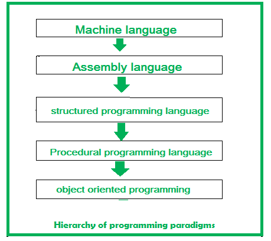
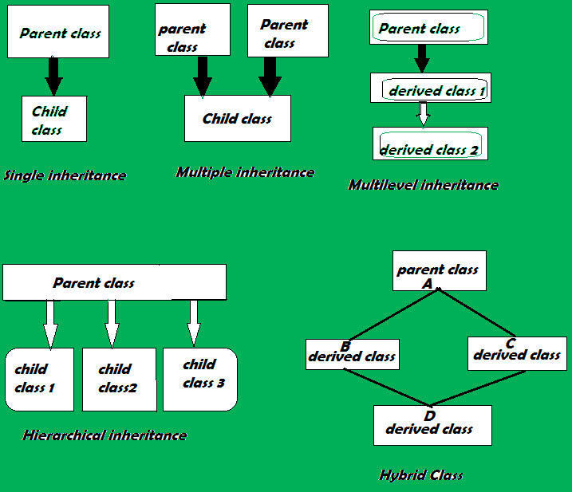
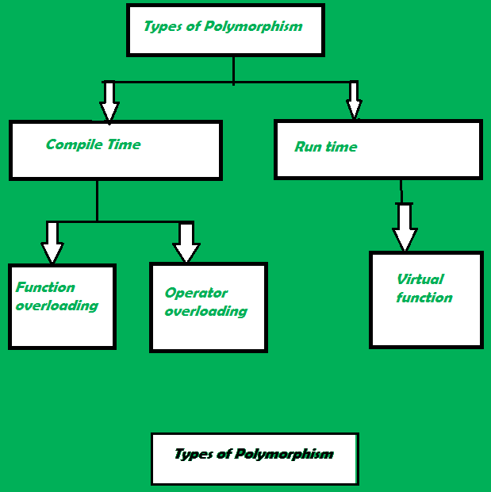

# Object Oriented Programming

## Programming Approach Hierarchy

- At the beginning of the computing era, programming was usually limited to machine language programming. But it’s quite difficult to write a program or develop software in machine language.
- Assembly languages, which were near enough to the English language to easily understand. These assembly languages were used in microprocessors.
- The basic principle of the structured programming approach is to divide a program into functions and modules, makes the program more understandable and readable. This approach gives importance to functions rather than data. (PASCAL and C)
- Procedual approach is also known as the top-down approach, a program is divided into functions that perform specific tasks and mainly used for medium-sized applications. Data is global, and all the functions can access global data (data is not secured).(FORTRAN and COBOL)
- The OOP concept was basically designed to overcome the drawback of the above programming methodologies.OOP allows the writing of programs with the help of certain classes and real-time objects.( very close to the real-world)



cpp code : Go through [OOP_Basics](../mdFiles/oop_introduction.md) first.

## What Are Class & Object?

Extended concept of the structure used in C. It consists of several variables and functions.A class is the blueprint of the object.

## Data Abstaction

1. Physical Level:
It describes how the records are stored, which are often hidden from the user. It can be described with the phrase, “block of storage.”

2. Logical Level:
It describes data stored in the database and the relationships between the data. The programmers generally work at this level as they are aware of the functions needed to maintain the relationships between the data.

3. View Level:
Application programs hide details of data types and information for security purposes. This level is generally implemented with the help of GUI, and details that are meant for the user are shown.

## Encapsulation

Idea of wrapping data and the methods that work on data within one unit.(data and the functions that manipulate them)

## Inheritance

Inheritance is the ability of one class to inherit properties of another class, called the parent class.

Types:



## Polymorphism

Ability of data to be processed in more than one form. It consists of method overloading and method overriding.

Types:



Some important points about OOP:

- Doesn’t allow data to freely flow in the entire system.
- Data is protected from external functions.
- It models the real world very well.
- programs are easy to understand and maintain.
- OOP offers code reusability. Already created classes can be reused without having to write them again.

Points to be taken care while dealing with OOP:

- classes sometimes tend to be over-generalized.
- The OOP design is tricky and requires appropriate knowledge.

# Classes and Objects

- It is a user-defined data type, which holds its own data members and member functions.Can be accessed and used by creating an instance of that class.
- An Object is an instance of a Class. When a class is defined, no memory is allocated but when the object is created, memory is allocated.

creating class:

    class className 
    {
        /*class members*/
    };

creating class object:

    className objectName;

__Interesting Fact:__

    Why do we give semicolon at the end of class ?  
    The main reason why semi-colons is there at end of class is compiler checks if user is trying to create an instance of class at the end of it. Just like structure , Union. As a result once execution reaches at that line it create class and allocates memory to your instance.

## Accessing data members and member functions

The data members and member functions of class can be accessed using the dot(‘.’) operator with the object.

example:

    objectName.func();  OR  objectName.variable = value;

The private data members are not allowed to be accessed directly by the object. (Access controlled by access modifiers public/private/protected)

## two ways to define a member function

1. Inside class definition
2. Outside class definition (with the help of scope resolution operator)

Functions defined inside the class definition are by default inline.We can make any non-class function inline by using keyword inline with them.  
[__*Declaring a friend function is a way to give private access to a non-member function.__]

## Access Modifiers

Useful to achieve data hiding.

Types:

1. Public
2. Private
3. Protected

[By default the access modifier for the members will be Private.]

__Public:__  
All the class members declared under the public specifier will be available to everyone(accessed by other classes and functions too). The public members of a class can be accessed from anywhere in the program using the direct member access operator (.) with the object of that class.

__Private:__  
The class members declared as private can be accessed only by the member functions inside the class. They are not allowed to be accessed directly by any object or function outside the class. Only the member functions or the friend functions are allowed to access the private data members of the class.

__Protected:__  
The protected access modifier is similar to the private access modifier in the sense that it can’t be accessed outside of its class unless with the help of a friend class. The difference is that the class members declared as Protected can be accessed by any subclass (derived class) of that class as well.

Refer [Access Specifier sample program](../Access_specifiers.cpp)

## Inheritance

Inheritance is a feature or a process in which, new classes are created from the existing classes. The new class created is called “derived class” or “child class”(__Sub class__) and the existing class is known as the “base class” or “parent class” (__Super class__).  
the derived class inherits all the properties of the base class, without changing the properties of base class and may add new features to its own.

- Avoids duplication of code in presence of common parameters.
  
Syntax:

    class  <derived_class_name> : <access-specifier> <base_class_name>
    {
            //body
    }

If no access-specifier is provided Private is taken by default.

    Note: A derived class doesn’t inherit access to private data members. However, it does inherit a full parent object, which contains any private members which that class declares.

- When a base class is privately inherited by the derived class, public members of the base class becomes the private members of the derived class and therefore, the public members of the base class can only be accessed by the member functions of the derived class.
- when the base class is publicly inherited by the derived class, public members of the base class remains the public members of the derived class.


__Types of Inheritance:__

1. Single inheritance  [ A -> B ]
2. Multilevel inheritance  [ A -> B -> C ]
3. Multiple inheritance   [ A -> ( B & C ) ] Refer Cpp Code for [Multiple Inheritance.](../multiple_inheritance.cpp)
4. Hierarchical inheritance [ A -> { B ( D & E ) & C ( F & G)}] Refer Cpp Code for [Hierarchical Inheritance.](../hierarchical_inheritance.cpp)
5. Hybrid inheritance   [Combination of more than one types of inheritance]

__A special case of hybrid inheritance: Multipath inheritance:__

A derived class with two base classes and these two base classes have one common base class is called multipath inheritance. Ambiguity can arise in this type of inheritance.

```
     B
    / \
A -     - D  
    \ /
     C
```

Creating object of class D and trying to access variable of class A ! Refer Cpp Code for [Special Case of hybrid inheritance.](../hybrid_inheritance_special_case.cpp)

## Polymorphism

__polymorphism__ means having many forms.(ability of a message to be displayed in more than one form)  

__Types of Polymorphism:__

1. Compile-time Polymorphism. (Function & Operator overloading)
2. Runtime Polymorphism. (Virtual Functions)

__1.Compile-time Polymorphism:__  
This type of polymorphism is achieved by function overloading or operator overloading.

- __Function Overloading:__  
When there are multiple functions with the same name but different parameters, then the functions are said to be overloaded. There are certain Rules of Function Overloading that should be followed while overloading a function.
  - Parameters should have a different number.
  - Parameters should have a different sequence of parameters.

- __Operator Overloading:__  
C++ has the ability to provide the operators with a special meaning for a data type.  
For example, we can make use of the addition operator (+) for string class to concatenate two strings(Providing a new defination to any existing operator/changing the functionality of an operator).

- Redefining the meaning of operators really does not change their original meaning; instead, they have been given additional meaning along with their existing ones.
- Name of an operator function is always the operator keyword followed by the symbol of the operator, and operator functions are called when the corresponding operator is used.

Refer Cpp Code for [Operator overloading.](../operator_overloading.cpp)

__Almost all operators can be overloaded except a few. Following is the list of operators that cannot be overloaded:__

```
sizeof
typeid
Scope resolution (::)
Class member access operators (.(dot), .* (pointer to member operator))
Ternary or conditional (?:)
```

- For operator overloading to work, at least one of the operands must be a user-defined class object.
- Assignment Operator: Compiler automatically creates a default assignment operator with every class. The default assignment operator does assign all members of the right side to the left side and works fine in most cases (this behavior is the same as the copy constructor).
- Conversion Operator: We can also write conversion operators that can be used to convert one type to another type. Refer Cpp Code for [Cobversion Operator.](../operator_overloading.cpp)
- Overloaded conversion operators must be a member method. Other operators can either be the member method or the global method.
- Any constructor that can be called with a single argument works as a conversion constructor, which means it can also be used for implicit conversion to the class being constructed. Refer cpp [Example.](../implicit_conversion.cpp)

__2.Run-time Polymorphism:__

This type of polymorphism is achieved by Function Overriding.Also called __Late binding__ and __dynamic polymorphism__.  
__Function Overriding:__ Function Overriding occurs when a derived class has a definition for one of the member functions of the base class. That base function is said to be overridden. Refer cpp code [function overriding.](../implicit_conversion.cpp)

__Runtime Polymorphism with Data Members:__ Runtime Polymorphism can be achieved by data members in C++. Let’s see an example where we are accessing the field by reference variable which refers to the instance of derived class. Refer cpp [Example.](../runtime_polymorphism_datamembers.cpp)

__Virtual Function:__  
A virtual function is a member function that is declared in the base class using the keyword virtual and is re-defined (Overridden) in the derived class.  

Some Key Points:

- Virtual functions are Dynamic in nature.
- They are defined by inserting the keyword “virtual” inside a base class and are always declared with a base class and overridden in a child class.
- A virtual function is called during Runtime.

## Encapsulation

Binding together the data and the functions that manipulate them. Encapsulation can be implemented using classes and access modifiers.

__Features of Encapsulation:__

- We can not access any function from the class directly. We need an object to access that function that is using the member variables of that class.
- The function which we are making inside the class must use only member variables, only then it is called encapsulation.
- If we don’t make a function inside the class which is using the member variable of the class then we don’t call it encapsulation.
- Increase in the security of data.
- It helps to control the modification of our data members.

## Data Abstraction

Data abstraction refers to providing only essential information about the data to the outside world, hiding the background details or implementation.

__Abstraction using Classes__  
__Abstraction in Header files__

__Advantages of Data Abstraction:__

- Helps the user to avoid writing the low-level code
- Avoids code duplication and increases reusability.
- Can change the internal implementation of the class independently without affecting the user.
- Helps to increase the security of an application or program as only important details are provided to the user.
- It reduces the complexity as well as the redundancy of the code.

## Can a C++ class have an object of self type?

A class declaration can contain static object of self type, it can also have pointer to self type, but it cannot have a non-static object of self type.
__[what is type Self?]__

## Why is the Size of an Empty Class Not Zero in C++?

__Empty class:__ It is a class that does not contain any data members (e.g. int a, float b, char c, and string d, etc.) However, an empty class may contain member functions.

Simply a class without an object requires no space allocated to it. The space is allocated when the class is instantiated, so 1 byte is allocated by the compiler to an object of an empty class for its unique address identification. Suppose, if a class does not have any size, what would be stored on the memory location? That’s the reason when we create an object of an empty class in a C++ program, it needs some memory to get stored, and the minimum amount of memory that can be reserved is 1 byte.

__What if the Base class is empty and the derived class is having member function?__

```
class Empty { };
 
class Derived : Empty 
{
    int a;
};
```

- sizeof derived class will give 4 in above case.

```
Reason: The output is not greater than 4. There is an interesting rule that says that an empty base class need not be represented by a separate byte. So compilers are free to make optimization in case of empty base classes. 
```

## Static data members of class in C++

- Declared using static keyword.
- Only one copy of that member is created for the entire class and is shared by all the objects of that class, no matter how many objects are created.
- It is initialized before any object of this class is created, even before the main starts.
- It is visible only within the class, but its lifetime is the entire program.

Syntax:

    static data_type data_member_name;

Example:

``` c++
// C++ Program to demonstrate the working of static data member
#include <iostream>
using namespace std;

class A {
public:
    A()
    {
    cout << "A's Constructor Called " << endl;
    }
};

class B {
    static A a;

public:
    B()
    {
    cout << "B's Constructor Called " << endl;
    }
};

// Driver code
int main()
{
    B b;
    return 0;
}
```

Output:

    B's Constructor Called 

Static members are only declared in a class declaration, not defined. They must be explicitly defined outside the class using the scope resolution operator.

__Accessing a Static Member:__

```c++
//inside class B:

static A getA()
    {
      return a;
    }

main()
{
    B b;
    A a = b.getA();
}
```

Will get an error (Here static member ‘a’ is accessed without explicit definition.)

__Defining Static Data Member:__

```c++
    // Definition of a
    A B::a;
```

We can access any static member without any object by using the scope resolution operator directly with the class name.

Refer cpp [Example.](../static_members_in_class.cpp)

__Some interesting facts about static member:__

- Some interesting facts about static member
- static member functions do not have this pointer.  
- A static member function cannot be virtual.
- Member function declarations with the same name and the name parameter-type-list cannot be overloaded if any of them is a static member function declaration.
- A static member function can not be declared const, volatile, or const volatile.

## Friend Class and Function

__Friend Class:__  
A friend class can access private and protected members of other classes in which it is declared as a friend. It is sometimes useful to allow a particular class to access private and protected members of other classes.

Syntax:

    friend class class_name;    // declared in the base class

Refer cpp [Example.](../friend_class.cpp)

We can declare friend class or function anywhere in the base class body whether its private, protected or public block.

__Friend Function:__

To grant special access to private and protected members of a class in C++. They are the __non-member__ functions that can access and manipulate the private and protected members of the class for they are declared as friends.  

- Friend functions cannot do any run-time polymorphism in their members.(Virtual function)

A friend function can be:

- A global function
- A member function of another class

```
Note:  
The order in which we define the friend function of another class is important and should be taken care of. We always have to define both the classes before the function definition. Thats why we have used out of class member function definition.
```

Refer examples, [friend function](../friend_function.cpp) and [global friend function.](../global_friend_function.cpp)

## Local Classes in C++

A class declared inside a function becomes local to that function.

- A local class name can only be used locally i.e., inside the function only.
- The methods of a local class must be defined inside it only. (defination using scope resolution is not valid)
- A local class can have static functions but, not static data members.
- Member methods of the local class can only access static and enum variables of the enclosing function. Non-static variables of the enclosing function are not accessible inside local classes.
- Local classes can access global types, variables, and functions. Also, local classes can access other local classes of the same function.

Refer example, [Local Class.](../local_classes.cpp)

## Nested classes in C++

A nested class is a class which is declared in another enclosing class. A nested class is a member and as such has the same access rights as any other member. The members of an enclosing class have no special access to members of a nested class; the usual access rules shall be obeyed.

## Final Class in C++

Designing a class in C++ which can’t be inherited. Can be achieved using private constructor, virtual inheritance, and friend class.
Refer example, [Final Class.](../final_class.cpp)
